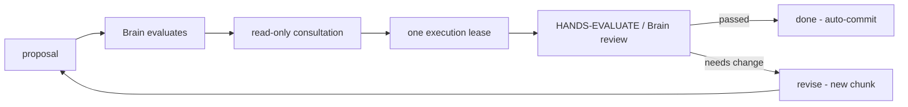

<p align="center">
  <h1 align="center">OpenBridge</h1>
  <p align="center"><em>formerly Mind-Limb Bridge</em> · binary <code>bridge</code></p>
  <p align="center">HANDS builds in small autonomous chunks. Brain reviews each one. You watch.</p>
  <p align="center">
    <a href="https://github.com/sujal-b/OpenBridge/actions"></a>
    <a href="https://nodejs.org">=22"></a>
    <a href="LICENSE"></a>
    
  </p>
</p>

| **v0.1.0** | **36 commits** on `main` | **29 test files** | **4 eval suites** | **~30 CLI commands** | **Node >=22** | **CI ubuntu + windows** |

## 30 second quickstart

**Prereqs:** Node >=22, Git with one baseline commit, [opencode CLI](https://opencode.ai) installed and authenticated.

```powershell
bridge install          # install global command once, from any folder
bridge open .           # prepare existing project
bridge run "Add upload validation"  # start task + live dashboard
```

Fresh project: `bridge new "D:\Projects\My-New-Project" --name "Your Name" --email "you@example.com"` then `bridge run "your task"` (`--name`/`--email` optional if Git identity exists).

`bridge open .` creates `.opencode/agents/` and updates `.gitignore` (idempotent, preserves existing content). Global settings never changed. `ask-codex` MCP still needs one time install.

## How it works



- HANDS proposes one chunk with named files and focused validation. Loop runs without a manual approval prompt.
- Single use lease, only the holder can execute approved files. Interrupted execution invalidates the lease, next run consults Brain again.
- No new chunk until Brain runs `bridge done` or `bridge revise`.
- If HANDS cannot make a safe proposal (missing dependency), it stops. Continue with `bridge revise "Use the minimal implementation with focused tests"`.

```powershell
bridge revise "Use a smaller change and add a unit test"
bridge done "Reviewed changes and tests pass"
```

**Live monitoring:**

- `bridge watch` repaints one frame, Flow shows handoff and Evaluation shows latest review (`hands_consulting` waits for Brain, `hands_executing` shows chunk).
- `bridge inspect` opens browser inspector with MIND/HANDS summaries, timeline per chunk, sanitized tool cards, terminal synced controls.
- Most commands accept `--project <folder>`.

Dashboard keys: `[i]` steer · `[a]` approve · `[p]` pause · `[r]` resume · `[s]` stop · `[q]` quit

## Model routing

| Role | Model | How it runs |
|------|-------|-------------|
| HANDS, HANDS-PROPOSE, HANDS-CONSULT, HANDS-EVALUATE | `opencode/muse-spark-1.2-contributor-free` | `opencode run` subprocess |
| MIND / Brain | `opencode/muse-spark-1.3-contributor-free` | `opencode run` with `brain` agent profile |

Brain never uses direct HTTPS. Consultation allows only Brain MCP tool. Execution may edit only approved files. Evaluation denies edits, subagents, skills, external access.

## Command reference

All commands match `bridge --help`. Most accept `--project <folder>`.

| Command | What it does |
|---------|--------------|
| `bridge install` | Install global bridge command |
| `bridge new <folder>` | Create project with Git baseline |
| `bridge open [folder]` | Prepare existing project |
| `bridge doctor` | Check installation health |
| `bridge run "task"` | Start task and open dashboard |
| `bridge watch` | Attach dashboard to running session |
| `bridge inspect` | Open browser inspector |
| `bridge steer "guidance"` | Inject guidance mid flight |
| `bridge pause` | Pause session |
| `bridge resume` | Continue paused session |
| `bridge stop` | Cancel session |
| `bridge approve` | Manual approval (legacy compat) |
| `bridge revise "guidance"` | Revised guidance after a block |
| `bridge done "summary"` | Mark session complete |
| `bridge recover [--review]` | Recover interrupted HANDS run |
| `bridge unlock` | Remove stale coordinator lock |
| `bridge unlock-agent` | Remove stale HANDS agent lock |
| `bridge status` | Show current session state |
| `bridge history [n]` | Show last n audit entries |
| `bridge policy` | Show project safety policy |
| `bridge latency [--json]` | P50/P95 per phase |
| `bridge latency --clear` | Reset latency data |
| `bridge config` | Show Brain and Hands config |
| `bridge config migrate` | Migrate legacy project to gen3 |
| `bridge config brain list` | List available Brain providers |
| `bridge config brain add <n>` | Add custom Brain provider |
| `bridge config brain rm <n>` | Remove custom Brain provider |
| `bridge config brain use <n>` | Set active Brain provider |
| `bridge config hands list` | List Hands providers |
| `bridge config hands add <p> <m>` | Add Hands model |
| `bridge config hands use <p> <m>` | Set active Hands model |
| `bridge --version` / `-v` | Show version number |

## Project status

- **Version:** v0.1.0 (`mind-limb-bridge` in package.json, MIT, `engines: node >=22`, bin `bridge`)
- **History:** 36 commits on `main` (remote `https://github.com/sujal-b/OpenBridge`)
- **CI:** GitHub Actions on `ubuntu-latest` and `windows-latest` with Node 22
- **Tests:** 29 files under `test/`, run with `npm test` (`node --test "test/*.test.js"`)
- **Suites:** 4 eval suites (`evaluate.ps1`, `evaluate-control-room.ps1`, `evaluate-recovery.ps1`, `preprod-evaluate.ps1`) plus `qa-*` Node suites

## Safety and records

- `.bridge/state.json` is authoritative. `.bridge/state.json.corrupt-*` keeps repaired snapshot for 7 days.
- `.bridge/events.jsonl` is lifecycle log. `.bridge/actions.jsonl` records bounded tool summaries with redacted secrets.
- `.bridge/policy.json` holds safe defaults and overrides. View with `bridge policy`.
- `.bridge/agent.lock` prevents parallel HANDS calls. HANDS session ID preserved across chunks.
- Single use execution lease prevents duplicate execution.
- Dirty tree blocks execution as `dirty_tree`. Remedy: `bridge resume --commit "checkpoint"` (custom message optional, staged index never swept).
- Non-Git projects cannot enter execution. Changed files checked against approved list (untracked, deleted, renamed, out of scope).
- `hands-evaluate` is read only, reports pass or fail without changing files.
- Provider failures can be resumed. Material proposal blockers require `bridge revise`.
- Recover before resume: `bridge recover` then `bridge resume` then `bridge run`. Stale locks removed only when ownership proven dead.
- Accepted chunks auto committed as `bridge(chunk): <task>`. Only chunk scope committed, your staging never swept.

## Advanced (deep dives)

<details>
<summary>Latency instrumentation</summary>

- Every run records spans to `.bridge/latency.jsonl`: phase wall time, provider cold start vs work, Brain HTTP timings, coordinator calls, prompt/response sizes, git snapshots under lock.
- Spans buffered, flushed on timer. Never takes telemetry lock.
- `phase.execute` includes `phase.reviewResult` when run continues. Nested phases `nested:true`.
- `git.snapshot` reports `under_lock` time. Rotates at 4 MB. Set `MIND_LIMB_LATENCY=0` to disable.

```powershell
bridge latency              # P50/P95 per span
bridge latency --json       # machine readable
bridge latency --clear      # reset data
```

</details>

<details>
<summary>Provider fallback</summary>

- Read only proposals retry once after transient failures, invalid output, or timeouts.
- Hard fault (HTTP 5xx, `UnknownError`, crash) drops poisoned session and retries fresh. Reusing faulted session reproduces fault.
- Error payloads humanized: `Provider server error: UnknownError (ref err_...)` keeps ref for debugging. Code not blindly replayed after failure.
- OpenCode JSON is an event stream. Bridge unwraps decision from `part.text`, tolerates markdown wrappers without treating text as approval.
- Optional env vars: `MIND_LIMB_AGENT_RETRY_ATTEMPTS=2`, `MIND_LIMB_AGENT_RETRY_DELAY_MS=250`, `MIND_LIMB_PROPOSAL_TIMEOUT_MS=180000`, `MIND_LIMB_EXECUTION_TIMEOUT_MS=600000`, `MIND_LIMB_AGENT_TIMEOUT_MS=300000`, `MIND_LIMB_MAX_CHUNK_FILES=3`, `MIND_LIMB_BRIDGE_TIMEOUT_MS=630000`.
- Direct API consultation skips redundant HANDS echo. Set `MIND_LIMB_REQUIRE_CONSULT_CONFIRM=1` to restore it.
- Runner commands run in process. Set `MIND_LIMB_COORD_INPROCESS=0` to spawn per command.
- `bridge run` returns on first state mark in `.bridge/state.json` (cap 5s, tune `MIND_LIMB_RUNNER_READY_MS`). Brain HTTP reuses TLS, config reads use mtime cache.

</details>

<details>
<summary>Git ownership and working tree</summary>

- Bridge never commits your own work, only its own execution churn.
- Before a chunk runs the tree must be clean. Block lists first 10 offending files. Remedy: `bridge resume --commit "checkpoint"` commits and resumes. `bridge revise` refused at this block.
- Scaffold files (`opencode.json` via `bridge open`/`new`) tracked by hash in `.bridge/scaffold.json` and auto committed when untracked and unchanged. Edited scaffold becomes yours and blocks.
- Agent runtime dirs (`.omo/`, `.opencode/`, `.claude/`, `.cursor/`, `.codex/`, etc.) untracked files never count as dirt. Tracked changes inside them still block. For other generated paths add to `.gitignore` or `approval.ignorePaths` in `.bridge/policy.json`.
- Revision cycles are hands free: rejected attempt changes may stay if HEAD is on chunk baseline and every dirty file is inside accumulated approved scope. Anything you add or commit mid cycle snaps strict clean rule back.
- `bridge run` auto resumes blocked sessions (dirty tree, provider failures, revisions pending). Only refusals are `bridge recover` after interrupted execution, or `bridge revise`/`bridge done` after policy escalation.

</details>

<details>
<summary>Validation</summary>

- Baseline: `& .\evaluate.ps1`
- Control Room: `& .\evaluate-control-room.ps1`
- Recovery: `& .\evaluate-recovery.ps1`
- Isolated preprod: `& .\preprod-evaluate.ps1`
- Coverage: CLI behavior, coordinator transitions, atomic state commits, provider timeouts, session reuse, no parallel locking, telemetry concurrency, inspector HTTP/SSE, bounded logs, sequential chunks, concurrent mutations, stale locks, Git checks.
- `qa-*` Node suites cover detector, recovery, state, race, CLI regressions. `MIND_LIMB_AGENT_TIMEOUT_MS` is default for proposal/execution/consultation. Per command `--timeout-ms` takes precedence.

</details>

---

MIT License, see [LICENSE](LICENSE). Start with `bridge run "your task"`.
